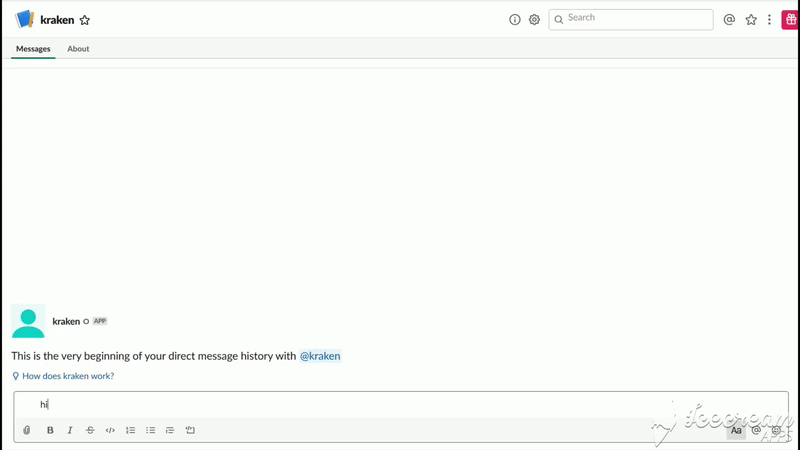

# Kraken - The Slack Bot

The purpose of this project is to showcase a contextual AI assistant built with the open source Rasa framework. Kraken is a prototype version, helping **xTalents** getting started with requesting certificates from Slack. It supports the following user goals:
<ul>
  <li>Requesting certificates</li>
  <li>Handling basic chitchat</li>
</ul>

# Overview of the files

`data/stories` - contains stories 
`data/nlu` - contains NLU training data 
`domain.yml` - the domain file, including bot response templates 
`config.yml` - training configurations for the NLU pipeline and policy ensemble 

# Demo
#### Work certificate

#### Salary certificate

### Expense report

